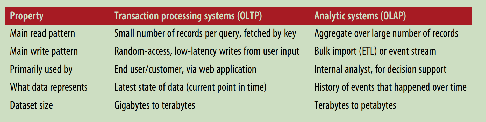
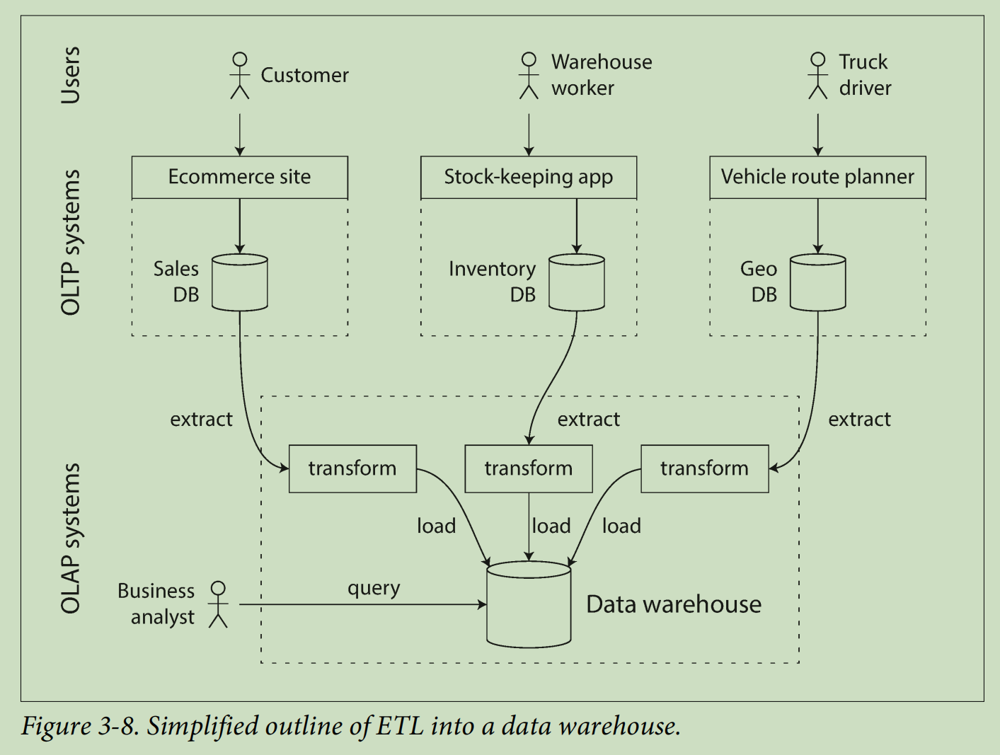
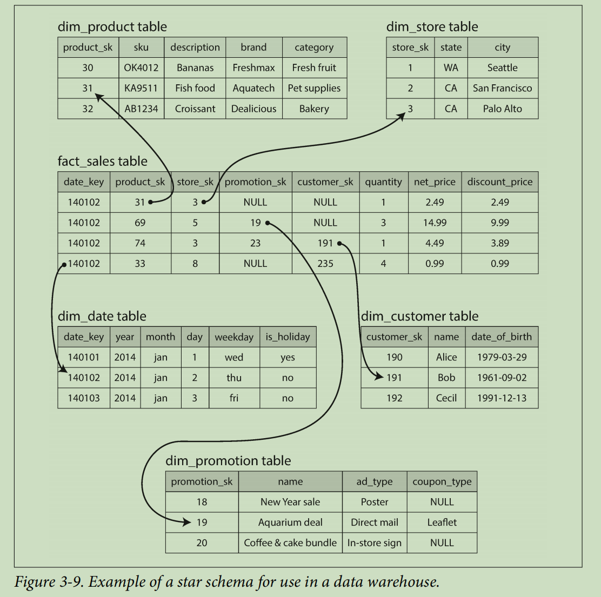
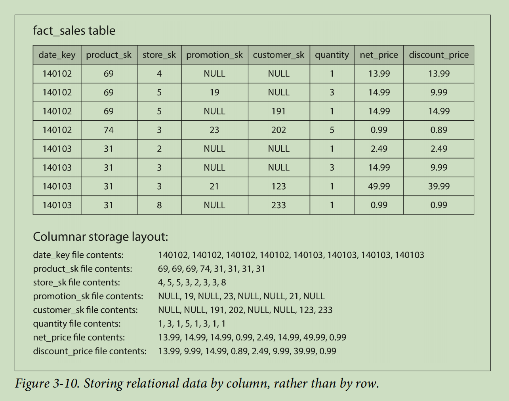
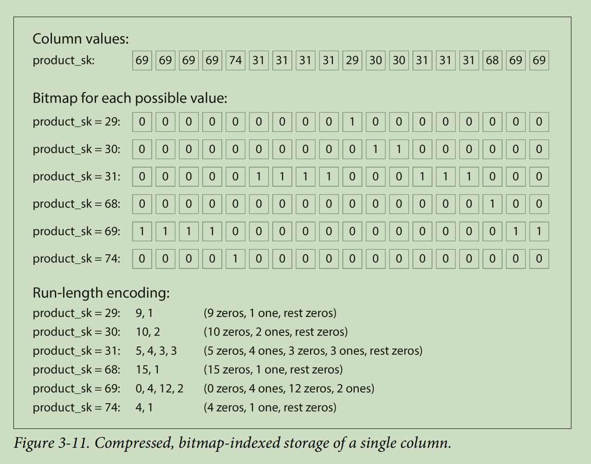
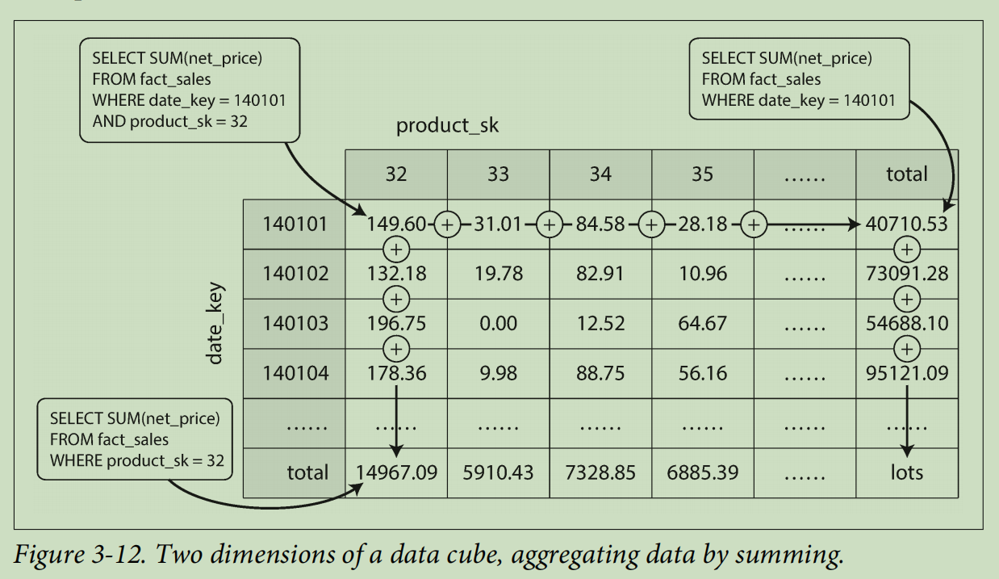

# CHAPTER 3: Storage and Retrieval

# Data Structures That Power Your Database
* 用一个 text file 来完成一个简单的 kv store。所有的 record 都是 append only 的。
    * pro：write is efficient
    * con: when data set is large, **hard to query**!
* 解决办法：add an **index** 
    * pro: query speed up
    * con: index is an additional metadata -> slow down writes
* 所以，DB 不会 index everything，它会让 developer 自己选需要 index 的 part（which is often queried）

## Hash Indexes

### simplest indexing strategy: in-memory hash map(hash table)
    * append a new key-value pair
    * update the hash map to reflect the offset(location) in the data file
    * when you look up a value -> use hash map to find the offset

### in-memory hashmap 应用场景 （Bitcask）
* value is updated frequently

### 如何避免 disk run out of space?
* break the log into segments -> frequently write to new segment file
* perform log compaction

* merge several segments together when performing compaction

### Some details

1. File Format
    * binary format -> faster and simpler

2. Deleting records
    * use **tombstone** label deleted records

3. Crash recovery (**in-memory hashmap crashed 了怎么办？**)

    * reading entire segment files from beginning to end
    * update the most recent offset (rebuild in-memory hash map)
    * better: storing a snapshot for each segment's hash map

4. Partially written records(**DB 写到一半挂了怎么办**)
    * Bitcask file + checksums
    * delete and ignore partially written records

5. Concurrency control
    * data file segments are append-only and immutable -> **read concurrent**
    * mostly only one write thread 

### 为啥不直接 overwrite old value？

* appending and segment merging is much faster than random writes
* concurrency and crash recovery are much simpler if segment files are append only or immutable
* merging old segments avoids the problem of files getting fragmented over time

### Hash table index limitations

* hash table must fit in memory
* range queries are not efficient

---------

## SSTables and LSM-Trees

### SSTable
* 紧接着上一个 section，把 log files 里面的 key sorted 存起来的 format，叫 Sorted String Table（SSTable）
    * each key only appears once within each merged segment file

### SSTables 的 advantages over log segments

1. Merging segments is simple and efficient - **MergeSort**

> 如果 same key 出现在 several input segments 怎么办？
    
    * keep the one from most recent
    * discard values in old segments

2. 不需要为了查找一个 key 把所有的 keys 都存在 memory
 
    * 大概定位 key 的位置
    * 在对应的 range 里，再查找 key
    * **注意**：SSTable 是存在 disk 的，那么还需要一个 in-memory index - memtable 来快速定位 range

3. group a range of records in block and compress it
    * save disk space
    * save I/O

### storage engine workflow using SSTables

* 如何serve write 呢？write come in -> add it to an in-memory balanced tree (e.g. red-black tree), we call it **memtable**
* memtable grows bigger than threshold -> write it disk as an **SSTable file** (所以 memtable 是在 memory 存着，SSTable 是在 disk)
* 如何 serve read 呢？read request -> look into memtable -> most recent on disk segment -> next on disk segment, etc.
* merge and compact segment files in the background

### 这个 workflow 的一个 problem？
* 如果 DB crash 了，在 memtable 的 records 还没来得及 write to disk, 就 lost 了。
* Solution：every write appended in memtable -> keep a log on disk, 这个 log 可以是不 sorted 的，只是为了防止 memtable records lost 和用来 recover

### Making an LSM-tree out of SSTables

* **Cassandra** and **HBase** 就是用 Memtable + SSTable 的 idea 实现的
* 最早这个 indexing structure 叫 log-structured merge tree(**LSM-Tree**)
    * Lucene（used by ElasticSearch and Solr） 也是用 LSM Tree 实现的

### LSM-tree 的一个 problem？
* 如果 DB 没有要 search 的 key，那么就会很慢！
* Solution：**Bloom Filters**。quickly tell you whether a key is existed or not

### Different strategies for SSTables compacted and merged

#### size-tiered compaction (HBase, Cassandra)
* newer and smaller SSTables are successively merged into older and larger SSTables

#### leveled compaction (Cassandra)
* key range is split up into smaller SSTables and older data is moved into separate “levels”

---------
## B-Trees（应用更广）

### B-Tree 和 SSTables 的异同
* 相同点：它和 SSTables 一样，也是 keep key-value pairs **sorted by key**
* 不同点：
    * Log-structured: break down to **variable-size** segments(several MB or more)
    * B-Tree: break down to **fixed-size blocks** or pages(4kb)

### 如何 lookup？
* each page is identified by address or location -> one page is designatated as root
* trace down from the root to children
* most DB has 3-4 level depth

### 如何 add a new key？

* find the page -> add it to that page
* if no enough page -> split into two half-full pages

### B-Tree write 的本质
* **overwrite** a page on disk with new data
    * 和 log-structured indexes 有本质的不同（append-only）
* overwrite 必然导致 write 的效率不如 LSM Tree

### Crash Recovery
* records write to a write-ahead log(WAL), also known as redo log
* 先写 redo log，再 overwrite B-Tree records 

### Concurrency control
* lightweight locks: protect tree's data structures with latches
    * LSM is simpler: do all the merging without interfering with incoming queries and atomically swap old segments

### B-tree optimizations
* copy-on-write schema(not directly overwrite)
    * modified page write to different loc -> a new verison of parent pages created and point to new location
* not store entire key, abbreviate it
* lay out the trees -> so that leaf pages appear in sequential order on disk
* additional pointers added 
    * e.g. have references to its sibling pages to left and right
* B-tree variants, e.g. fractal tree borrow some log-structured ideas

-------
## Comparing B-Trees and LSM-Trees

* 简单来说，就是
    * **LSM**：write
    * **B-tree**: read 

### LSM-tree 优点
* LSM-trees are able to sustain higher write throughput
    * it has lower write amplification
* compress better -> produce smaller files
    * periodically rewrite SSTables to remove fragmentation -> lower storage overheads

### LSM-tree 缺点
* compaction process can sometimes interfere with performance of ongoing reads and writes
* at high write throughput, more disk bandwidth is required for compaction when db gets bigger
* B-tree: each key exists in exactly one place -> easy to offer strong transactional semantics(locks on range of keys)
    * LSM-tree: may have keys in multiple segments

------------
## Other Indexing Structures

### Secondary Indexes

* add a secondary index -> crucial for performing join efficiently
* secondary index 的 keys are not unique:
    * 解决办法：
        * option 1: make each value in the index a list of matching row ids
        * option 2: make each key unique by appending a row id to it

### Storing values within the index - storing heap file

* secondary index 的 value 可以是 actual rows（document，vertex） * （more common）the value could also be a reference to the row stored, the place where rows are stored is **heap file**
    * avoid duplicating data when multiple secondary indexes are present
* 缺点：相比于直接读到了值，存 ref loc 影响 reads performance
    * 改进：**clustered index**: store indexed row directly within a index
        * e.g. InnoDB engine, the PK of a table is always a clustered index; secondary index refer to PK(rather than a heap file loc)
    * **covering index**（clustered index 和 non clustered index 的折中）: store some of a table's columns within the index 
    * cluster and covering index: speed up reads, but add overhead on write

### Multi-column indexes
* concatenated index: combine several fields into one key
* particularly important for geospatial data
    * e.g. query a loc with both latitude and longitude columns
* B-tree: translate 2d loc into single number using a space-filling curve
* (more common) geospatial index - R-tree

### Full-text search and fuzzy indexes (模糊查询)
* Lucene: search text for words within a certain edit distance
    * SSTable-like structure: for term dictionary
    * in-memory index: similar to trie, a finite state automation over characters in the keys

### In-memory database
* Memcached: intended for caching use only; acceptable for data lost
* if aim for durability: 
    * write log changes to disk; 
    * write periodic snapshots to disk;
    * replicate in-memory state to other machines
* in-memory db is restarted:
    * reload its state from disk or over the network from other replica
    * disk is merely used as an append-only log for durability
    * read is entirely from memory

### 为什么 in-memory db 效率高
* not due to the fact they don't need to read from disk
    * 因为 disk-based storage 读了最近的一些 records，也会被 cache
* because they can avoid overheads of encoding in-memory data in the form that can be written to disk
* because in-memory db is providing data models that are difficult to implement with disk-based indexes
    * e.g. Redis provides priority queues and sets

### in-memory db 能支持比 memory 大的数据规模吗？
* 能
* anti-caching approach: 
    * evict the least recently used data from memory to disk
    * load it back into memory when it is accessed again

---------
# Transaction Processing or Analytics?

* ACID: atomicity, consistency, isolation, durability.
* transaction doesn't necessarily have ACID, just mean to make low-latency reads and writes

### OLTP - (online transaction processing)
* focus on processing **transaction**

### OLAP - (online analytic processing)
* focus on **data analytics**
* calculate aggregate statistics (expensive query)

---------

## Data Warehousing - run analytics

### Data Warehousing workflow - ETL (Extract-Transform-Load)
* construct a read-only copy from all the various OLTP systems
* 如何拿到这些数据：
    * periodic data dump
    * continuous stream updates

### Data warehouse product
* vendors: Teradata, Vertica, SAP HANA, ParAccel
    * Amazon RedShift is on top of ParAccel
* SQL-on-Hadoop:
    * Apache Hive, Spark SQL, Cloudera Impala, Facebook Presto

## Stars and Snowflakes: Schemas for Analytics

### star schema (more popular since it's simpler)
* **fact table**: each row represents an event that occurred at a particular time(who, what, where, when, how and why)
* **dimension tables**: represents the who, what, where, when, how and why

### snowflake schema
* dimensions are further broken down into subdimensions
* schemas are more normalized

--------
# Column-Oriented Storage

* data warehouse 的 fact tables query 起来很麻烦。有很多 rows，但 query 只对几个 column 感兴趣。
* 如何优化呢? - column oriented storage

### basic idea
* don't store all the values from one row together
* store all the values **from one column** together
* if need to reassemble an row -> get same index item from each column file

## Column Compression

### bitmap encoding

### Memory bandwidth and vectorized processing
* data warehouse query data 的一个 bottleneck: bandwidth for loading data from disk to memory
    * column-oriented storage layouts are good for making efficient use of CPU cycles
        * query engine can take **a chunk of** compressed column data and fit them into CPU L1 cache
        * column compression allows more rows to fit in the same amount of L1 cache
    * vectorized processing
        * Operators(bitwise AND and OR) can be designed to operate on such chunks of compressed data directly
    
## Sort Order in Column Storage

* data needs to be sorted an entire row at a time

### how to sort?
* use knowledge of common queries to choose the columns 
    * 经常搜索 date -> use `date_key` as sort key
* 定下第一个 sort key，第二个 column 就尽量选 any rows that have the same value in the first column
* advantage: help compress the columns

### several different sort orders - Vertica
* replicated to multiple machines
* different sort orders

## Writing to Column-Oriented Storage

* column-oriented storage 的 read 是提高速度了，但是 write 就麻烦了
    * B-trees: **not possible** with compressed columns; have to rewrite all column files if insert a row in the middle
* **LSM-trees**:
    * first write to in-memory store -> add to a sorted structure -> prepare for writing to disk
    * accumulate lots of writes -> merged with column files on disk -> write to **new files** in bulk
    * query: examine column data on disk + recent writes in memory -> combine the two

## Aggregation: Data Cubes and Materialized Views

### materialized view

* data warehouse 的 query 有不同的办法：column storage - 提高效率；还可以用 materialized view - 提前计算存好。
* materialized view: an actual copy of query results

### data cube (OLAP cube)
* advantage: certain queries become very fast
* disadvantage: doesn’t have the same flexibility as querying the raw data

